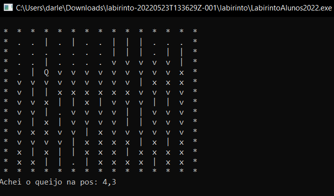

# Pilha - Labirinto 
## O objetivo é fazer com que o rato  percorra um caminho  de um ponto p1 a um ponto p2 em um labirinto até achar a posição do queijo, o percursso é encerrado até que o queijo seja encontrado, se não for encontrado o rato retorna ao ponto anterior para uma  nova tentativa de percurso.
Linguagem|IDE
---|---
C|Dev-C++
## Sistema funcionando

